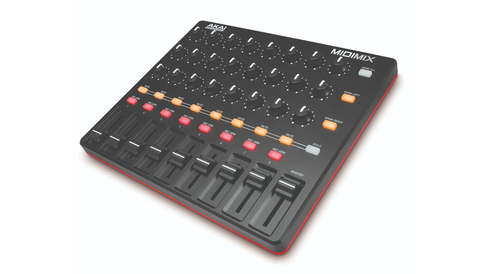
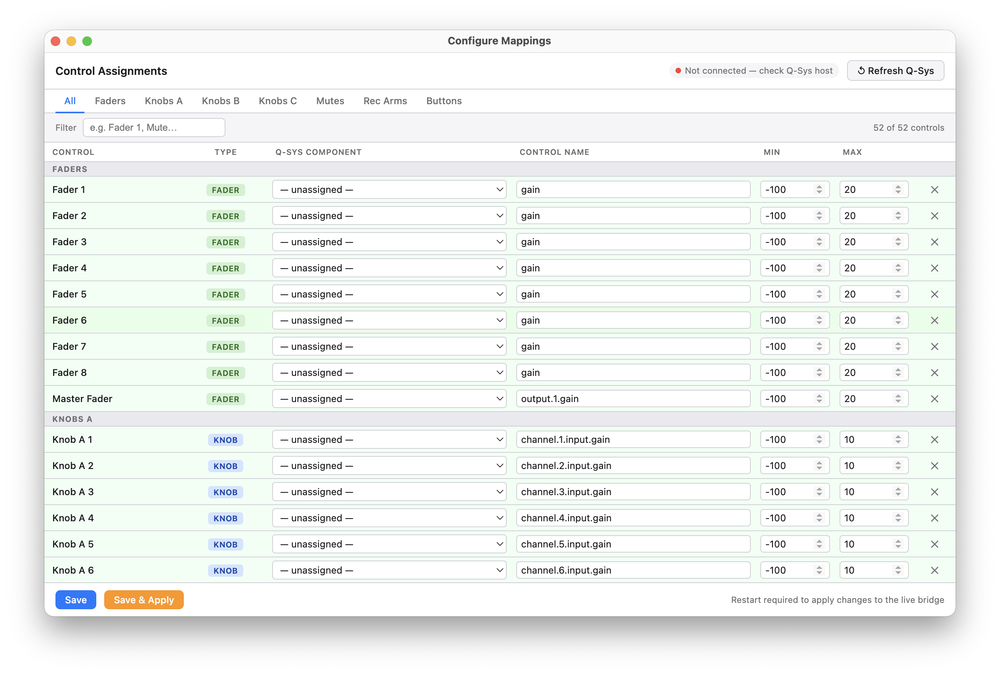

# MIDI Q-Sys Bridge





macOS menu-bar app that maps an **Akai MIDImix** to Q-Sys controls over QRC (TCP port 1710). Runs headlessly in the system tray with no window. Bidirectional: mute button LEDs stay in sync with Q-Sys state.

> **Primary hardware:** Akai MIDImix (USB class-compliant, 8 channels × 3 knob rows + faders + mute/rec-arm buttons). See [Adapting to other controllers](#adapting-to-other-controllers) if you want to use a different device.

---

## Requirements

- macOS (Apple Silicon or Intel)
- Node.js 20+
- Q-Sys Core with **External Control** enabled (Core Properties → External Control → Enable)
- Akai MIDImix connected via USB

---

## Installation

```bash
npm install
npm run rebuild-midi   # rebuilds native MIDI addon for your Electron version
npm start              # build + launch
```

To package a distributable DMG:

```bash
npm run package
# output: release/MIDI Q-Sys Bridge-0.2.5-arm64.dmg
```

---

## Config file location

The app looks for `config.json` in these locations, in order:

1. `~/Library/Application Support/midi-qsys-bridge/config.json` — user data dir (takes priority)
2. `<app bundle>/config/config.json` — bundled default

Edit the bundled `config/config.json` to get started, or copy it to the user data dir to survive app updates.

Use **Tray → Configure Mappings** to assign Q-Sys components to physical controls interactively — click **Save & Apply** to reload the bridge live without restarting. Use **Tray → Open Config File** to edit the raw JSON directly.

---

## Q-Sys Designer setup

The bridge talks to Q-Sys using **QRC (JSON-RPC 2.0 over TCP port 1710)**. No Lua scripting or Named Actions are required — it calls `Component.Set` and `Control.Set` directly.

### Signal flow design methodology

Every signal path uses a **Gain block before it enters a mixer or any effects**. This means:

- **Effects are post-fader** — signal goes: source → Gain block → effects/mixer
- **All gain adjustments happen at the Gain block** — the mixer channel levels are left at unity
- **All mutes happen at the Gain block** — do not mute at the mixer input; mute at the Gain block for that signal path
- **UCI faders and buttons must target the same Gain blocks** as the MIDI controller — otherwise MIDI and UCI will fight each other

The **only exception** is final output control: the mixer output gain and output mute (e.g. `Bus.Mixer output.1.gain` / `output.1.mute`) are the correct place to adjust final output level and kill the house mix.

This means in your Q-Sys design each channel looks like:

```
[Analog/USB Input] → [Mic.01.Gain (gain + mute)] → [Input.Mixer] → [Bus.Mixer] → [Output]
```

And in `config.json`, faders and mutes always target the Gain block component (`Mic.01.Gain`, `Styb.Gain`, etc.), never `Input.Mixer input.N.gain/mute`.

### What you need in the design

1. **Enable External Control** on the Core  
   Core Properties → External Control → ✓ Enable External Control

2. **Component names must match exactly**  
   Right-click a component in Designer → Properties to check the name. The config uses these by default:

   | Config name | What it should be in your design |
   |---|---|
   | `Input.Mixer` | Your main input mixer component |
   | `Matrix.Mains` | Main speaker matrix output |
   | `Matrix.ZoomTX` | Zoom transmit matrix output |

   These are just defaults — rename them in `config.json` to match whatever you have.

3. **Control names**  
   These come from Q-Sys's internal component API. For a standard Mixer component the gain/mute controls follow the pattern `input.N.gain` / `input.N.mute`. If you're using a custom schematic, open the component in Designer and hover a control to see its name.

4. **No Named Controls or Script access needed** — QRC external control handles it all.

---

## config.json reference

```jsonc
{
  "qsys": {
    "host": "10.4.84.20",    // Q-Sys Core IP
    "port": 1710             // QRC port — don't change unless you've moved it
  },
  "midi": {
    "deviceName": "MIDI Mix" // Substring match against MIDI port name
  },
  "mappings": [ ... ],       // see below
  "feedback": { ... }        // see below
}
```

### mappings

Each entry maps one MIDI event to one Q-Sys action.

```jsonc
{
  "label": "Mic 1 Fader",          // optional — shown in tray activity log
  "midi": {
    "type": "cc",                   // "cc" or "note_on"
    "channel": 1,                   // MIDI channel, 1-indexed
    "number": 19                    // CC number or note number
  },
  "qsys": { ... }                   // see action types below
}
```

### Q-Sys action types

#### `component_control` — set a value on a named component

Use this for faders, knobs, and any continuously variable control.

```jsonc
"qsys": {
  "type": "component_control",
  "component": "Input.Mixer",      // component name in Designer
  "control": "input.1.gain",       // control name within that component
  "min": -100,                     // value sent when MIDI = 0
  "max": 10                        // value sent when MIDI = 127
}
```

The MIDI value (0–127) is linearly scaled to the `min`/`max` range. For gain controls, `min`/`max` are in dB. For frequency controls, they're in Hz. For 0–1 range (e.g. send levels), use `"min": 0, "max": 1`.

**Knob center point:** The MIDImix knobs send CC 64 at center position. If you want center = 0 dB on a ±18 dB trim, set `"min": -18, "max": 18` — at CC 64 you'll get ≈ 0 dB.

#### `toggle` — flip a boolean control on/off

Use this for mute buttons. State is tracked locally and flipped on each Note On.

```jsonc
"qsys": {
  "type": "toggle",
  "component": "Mic.01.Gain",   // target the Gain block, not the mixer input
  "control": "mute"
}
```

With `feedback.enabled: true`, toggle state stays in sync with Q-Sys even if the mute changes from a UCI button, another controller, or a Lua script (see Feedback section below).

#### `named_control` — set a Named Control by name

Use this when you've exposed a control as a Named Control in Designer (Script → Named Controls). Works the same as `component_control` but uses `Control.Set` instead of `Component.Set`.

```jsonc
"qsys": {
  "type": "named_control",
  "name": "MyNamedControl",
  "min": 0,
  "max": 100
}
```

#### `snapshot` — load a snapshot

Triggered by Note On. Loads by name or by bank/slot.

```jsonc
// By name:
"qsys": { "type": "snapshot", "name": "My Snapshot Name" }

// By bank and slot:
"qsys": { "type": "snapshot", "bank": 1, "slot": 3 }
```

---

## Adapting to other controllers

The bridge is wired to the MIDImix in two places. To use a different controller you need to update both.

### 1. Discover your controller's MIDI map

Run the interactive learn script with your device connected:

```bash
node midi-learn.mjs
```

It walks you through every control one by one and records the CC channel/number or Note channel/number for each. Outputs a table and a config snippet. If your device has a different layout, edit the control list at the top of `midi-learn.mjs` before running.

### 2. Update the physical control definitions

Open `src/main/configurator.ts` and edit the `PHYSICAL_CONTROLS` array. Each entry describes one physical control and its MIDI address:

```typescript
{ id: 'F1', label: 'Fader 1', group: 'Faders', controlType: 'fader',  midi: m('cc',      7, 22) },
{ id: 'M1', label: 'Mute 1',  group: 'Mutes',  controlType: 'toggle', midi: m('cc',      1, 22) },
{ id: 'BL', label: 'Bank L',  group: 'Buttons', controlType: 'toggle', midi: m('note_on', 1, 25) },
```

`controlType` controls what the configurator generates when you assign a Q-Sys target:
- `fader` / `knob` → `component_control` (continuous, with min/max scaling)
- `toggle` → `toggle` (on/off, stateful)

### 3. Update config.json

Change `midi.deviceName` to a substring of your device's MIDI port name. The app does a substring match, so `"MIDI Mix"` matches `"MIDI Mix MIDI 1"`.

### 4. LED feedback

The MIDImix uses **Note On velocity 0** to turn off LEDs (not a Note Off message). Other devices vary — some use proper Note Off (0x80), some use CC, some have no LED control at all. If your device behaves differently, edit `sendNoteOff` in `src/main/midi-io.ts`.

---

## MIDImix layout and CC/note numbers

```
         CH1   CH2   CH3   CH4   CH5   CH6   CH7   CH8
Row A:   16    20    24    28    46    50    54    58    ← knobs (CC)
Row B:   17    21    25    29    47    51    55    59    ← knobs (CC)
Row C:   18    22    26    30    48    52    56    60    ← knobs (CC)
Solo:     2     5     8    11    14    17    20    23    ← buttons (note)
Mute:     1     4     7    10    13    16    19    22    ← buttons (note)
Fader:   19    23    27    31    49    53    57    61    ← faders (CC)

Master fader: CC 62
BANK L button: note 25
BANK R button: note 26
```

All MIDI channel 1.

---

## What to assign to the knobs

The three knob rows give you 24 CCs. Only Row A is wired by default (pre-fader trim). Some ideas for the other rows:

| Row | Suggested use | Q-Sys control pattern |
|---|---|---|
| Row A (16–18 series) | Pre-fader trim ±18 dB | `input.N.trim`, min -18 max 18 |
| Row B (17–21 series) | HPF cutoff frequency | `Mic.0N.HPF` component, `frequency` control, min 20 max 500 |
| Row B | Monitor/IEM send level | `input.N.send.1` or similar, min 0 max 1 |
| Row C (18–22 series) | EQ band gain | Component per-mic EQ band, min -12 max 12 |
| Row C | Compression threshold | Compressor component, `threshold`, min -40 max 0 |
| Solo buttons | Bus mute toggles | `Bus.Mixer`, `input.N.mute` |
| Solo buttons | Snapshot recall | `type: snapshot` per button |

The control names for sub-components (HPF, compressor, EQ) depend on how your Q-Sys design is structured. If they're inside a larger component rather than individual blocks, you may not be able to address them via `Component.Set` — in that case, expose them as Named Controls in Designer and use `type: named_control`.

To find the right control name for any component:
1. In Q-Sys Designer, go to **Tools → QRC API Reference** (or use the MCP inspector)
2. Send `Component.GetControls` with the component name to list all addressable controls

---

## Feedback (bidirectional mute sync)

When `feedback.enabled` is `true`, the bridge subscribes to mute control changes using Q-Sys ChangeGroup AutoPoll. Q-Sys pushes updates over the same TCP connection at 50ms intervals. This keeps the MIDImix mute button LEDs in sync with whatever changes mutes in Q-Sys — UCI panels, Lua scripts, other controllers.

```jsonc
"feedback": {
  "enabled": true,
  "mute_leds": [
    // Each entry maps a Q-Sys mute control to a MIDImix LED
    { "component": "Mic.01.Gain", "control": "mute", "midi": {"channel": 1, "note": 1} },
    { "component": "Mic.02.Gain", "control": "mute", "midi": {"channel": 1, "note": 4} }
    // ... etc
  ]
}
```

The note numbers in `mute_leds` must match the note numbers in the corresponding `toggle` mappings for the LEDs to track correctly.

When `enabled: false`, toggle state is tracked locally only — the LED will drift if anything else changes the mute outside the MIDI controller.

---

## Unresolved modifier buttons

Two physical buttons on the MIDImix are **modifiers by design** and are not currently assignable in the Configure Mappings UI.

### SEND ALL
The SEND ALL button sends **CC ch4/22** — the exact same MIDI message as Knob A 1. There is no way to distinguish the two at the MIDI level. Its design intent is: hold SEND ALL and turn any knob to broadcast that value to all 8 channels of that knob row simultaneously (a "gang" function for bulk-setting sends). Not yet implemented.

### SOLO
The SOLO button (note ch1/27) is designed as a modifier: hold SOLO and press a mute button to solo that channel (mute all others, unmute the selected one). Its LED is controlled by the device firmware — it cannot be driven externally via MIDI Note On the way the mute LEDs can. Currently the button is wired as a simple output mute toggle, but solo-while-held behavior has not been implemented.

**Future options to consider:**
- SEND ALL: implement gang-knob broadcast in the bridge (when CC ch4/22 fires, write that value to all mapped knob-row targets)
- SOLO: implement hold-to-solo logic (track SOLO held state; intercept mute presses while held; mute all channels except the selected one)

---

## UCI / FOH mixer

The app also serves the FOH mixer web UI and relays browser WebSocket traffic to the Core, so an iPad (or any device) on the same WiFi as this Mac can control the mixer from a browser — no separate server or app needed.

**Access it at:**

- `http://localhost:<port>/foh-uci` on this Mac
- The LAN URL shown in **Tray → UCI** — also copyable via **Tray → Copy UCI Link**
- The Configurator's **Network** panel (**Configure Mappings… → Network — UCI Web Server**), which shows both the local and LAN URLs with their own Copy buttons

**Config:** controlled by the `uci.enabled` and `uci.port` keys in `config.json` (see `src/main/config.ts`) — `enabled` defaults to `true`, `port` defaults to `3001`. Both can also be set from the Configurator's **Network** panel (**Configure Mappings… → Network — Q-SYS & UCI**) — after changing the port, click **Restart Now** to apply it. If you're opening a firewall rule for this app, the UCI port is the one to allow.

**Network caveat:** this works over the same WiFi network only. If the venue network has AP/client isolation enabled, devices on the same SSID can't reach each other — that's a network configuration issue, not an app bug.

---

## Browser-based MIDI mappings

The MIDI-to-Q-Sys mapping table (the same data the desktop **Configure
Mappings** window edits) is also reachable from any browser on the LAN, so
you don't need physical or remote-desktop access to the Mac to remap a
control.

**First-time setup:** open **Configure Mappings… → Network** panel and set
a **Mappings Page** password — the page won't allow access until one is
set.

**Access it at:** `http://<lan-ip-or-localhost>:<port>/mappings` (same host
and port as the FOH UCI). Enter the password to sign in; the session lasts
24 hours per browser.

The page has the same capabilities as the desktop Configurator: assign
Q-Sys components/controls to physical MIDImix controls, and **Save** or
**Save & Apply** (applies live, no restart). Component/control lists are
fetched live from Q-Sys, same as the desktop version.

---

## Tray menu

Click the menu bar icon to see:

- **Q-Sys connection status** and Core IP
- **MIDI device status** and port name
- **UCI status line** — shows the LAN URL and connected client count when enabled, or an error if the UCI server failed to start
- **Copy UCI Link** — copies the LAN UCI URL to the clipboard
- **Recent activity log** (last 5 actions)
- **Open Config File** — opens the active config in your default editor
- **Quit**

The icon is filled when both Q-Sys and MIDI are connected, dim when either is disconnected. The app auto-reconnects to both if they drop.
